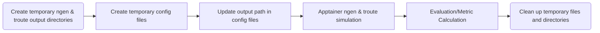

# HPC Implementation of the NextGen Calibration Tool

This branch documents the HPC implementation of the NextGen hydrologic model calibration workflow. It calibrates NextGen model parameters with SPOTPY, uses MPI for parallel calibration, and runs NextGen model simulations through Apptainer.

Most calibration concepts are the same as the local workflow, but this branch assumes an HPC module environment, an Apptainer `.sif` image in the repository root, and `--oversubscribe` for every parallel calibration run.

## Table of Contents

- [What This Does](#what-this-does)
- [Prerequisites](#prerequisites)
- [Installation](#installation)
- [Expected Data Layout](#expected-data-layout)
- [Quick Start](#quick-start)
- [Configuration](#configuration)
- [Execution Modes](#execution-modes)
- [Understanding the Output](#understanding-the-output)
- [Monitoring Progress](#monitoring-progress)
- [Troubleshooting](#troubleshooting)
- [Workflow](#workflow)
- [Customizing Calibration Parameters](#customizing-calibration-parameters)
- [Additional Notes](#additional-notes)
- [Support](#support)

## What This Does

At a high level, calibration means searching for parameter values that make simulated streamflow match observed streamflow.

This code:

1. Reads model/domain data under `data_root/gage-{gage_id}`.
2. Loads or downloads observed USGS flow for your date range.
3. Runs SPOTPY optimization (`SCE` or `DDS`) against an objective function (`KGE` or `RMSE`).
4. Writes the best parameter set and full optimization history to disk.

## Prerequisites

- HPC environment with module support
- Python
- OpenMPI
- Rust + Cargo
- Apptainer
- netCDF, HDF5, and SQLite
- `squashfuse` and `gocryptfs` for Apptainer/FUSE support
- Basic familiarity with `ngiab_data_preprocess`

## Installation

1. Load the required HPC modules.

   ```bash
   module load Python
   module load OpenMPI
   module load Rust
   module load rustup
   module load cargo-c
   module load Apptainer
   module load git
   module load netCDF
   module load HDF5
   module load SQLite
   module load squashfuse
   module load gocryptfs
   module load uv
   ```

   If your HPC site uses versioned module names, use the matching local versions. The important pieces are Python, OpenMPI, Rust/Cargo, Apptainer, netCDF, HDF5, SQLite, and the FUSE support modules needed by Apptainer.

2. Download rust routing because the simulation depends on rust routing
   ```bash
   cargo install --git https://github.com/CIROH-UA/rs_route.git
   ```
3. Check if the rust routing is installed by typing following command.
   ```bash
   rs-route
   ```

4. Clone the repository and enter it.

   ```bash
   git clone https://github.com/CIROH-UA/NGIAB-Spotpy.git NGIAB-Spotpy_SL
   cd NGIAB-Spotpy_SL
   ```

   The Apptainer image must be created from inside the repository root. The current source code invokes `ngiab_owp_openmpihpc.sif` as a relative path, so calibration commands should also be launched from the repository root.

   ```bash
   apptainer pull docker://sifanak/ngiab:owp_openmpihpc
   ```

   This should create `ngiab_owp_openmpihpc.sif` in the repository root.

   Do not pull the image from another directory. The code expects the image at this relative path from the repository root:

   ```text
   ./ngiab_owp_openmpihpc.sif
   ```

   Because the source code uses this relative path, run calibration from the repository root. The image belongs at the top level of the cloned repository, not inside `src/`.

5. Verify MPI:

   ```bash
   mpirun --version
   ```

6. Create and activate a virtual environment:

   ```bash
   python -m venv venv
   source venv/bin/activate
   ```
7. Install Python dependencies from `pyproject.toml`:

   ```bash
   pip install -e .
   ```

6. Use `--oversubscribe` for every parallel calibration run.

   ```bash
   mpirun -n 11 --oversubscribe venv/bin/python -m calibration -c config.yaml
   ```

   SPOTPY uses rank 0 as the coordinator and the remaining ranks as workers. For example, `-n 11` gives 1 coordinator and 10 worker simulations.

## Expected Data Layout

Before running calibration, `data_root` should contain a folder for your gage and supporting data folders:

```text
{data_root}/
└── gage-{gage_id}/
    ├── config/
    │   ├── realization.json
    │   └── troute.yaml
    ├── forcings/
    ├── metadata/
    └── outputs/
```

`data_root` is the parent directory, not the gage folder itself. The `forcings/` and `metadata/` directories are expected alongside `config/` within `gage-{gage_id}`.

Example:

- If your files are in `/tmp/ngen/gage-10163000/config/realization.json`, then `data_root` in `config.yaml` should be `/tmp/ngen`.

## Quick Start

### 1) Prepare data

```bash
uvx --from ngiab_data_preprocess cli -i gage-10163000 -sfr --start 2015-06-15 --end 2015-08-15 --source aorc
```

If you are unsure where the generated data lives, check:

```bash
cat ~/.ngiab/preprocessor
```

### 2) Edit `config.yaml`

All calibration inputs are controlled through `config.yaml`, including the gage ID, date range, data root, calibration settings, and execution mode.

Example:

```yaml
gage_id: "10163000"
start_date: "2015-06-15"
end_date: "2015-08-15"
training_start_date: "2015-07-15"
data_root: /path/to/data_root
algorithm: "DDS"
objective_function: "KGE"
repetitions: 100
dds_trials: 1
execution_mode: "serial"
merge_catchment: False
```

### 3) Run serial mode

```bash
python -m calibration --config config.yaml
```

### 4) Run parallel mode with merge_catchment feature (recommended for speed)

Set these values in `config.yaml`:

```yaml
execution_mode: "parallel"
merge_catchment: true
```

Then run with MPI:

```bash
mpirun -n 11 --oversubscribe venv/bin/python -m calibration --config config.yaml
```

### Required Config Fields

| Field | Type | Description | Example |
| --- | --- | --- | --- |
| `gage_id` | string | USGS gage ID used for observed flow retrieval and folder naming | `10163000` |
| `start_date` | string | Full simulation start date (`YYYY-MM-DD`) | `2015-06-15` |
| `end_date` | string | Full simulation end date (`YYYY-MM-DD`) | `2015-08-15` |
| `training_start_date` | string | Start of the calibration/evaluation window inside the simulation period | `2015-07-15` |
| `data_root` | string | Parent folder containing `gage-{gage_id}` | `/home/user/data` |

### Optional Config Fields

| Field | Type | Default | Options | Description |
| --- | --- | --- | --- | --- |
| `algorithm` | string | `DDS` | `SCE`, `DDS` | Search algorithm used by SPOTPY |
| `objective_function` | string | `KGE` | `KGE`, `RMSE` | Metric used to score each parameter set |
| `repetitions` | integer | `100` | positive integer | Number of optimization iterations |
| `dds_trials` | integer | `1` | positive integer | DDS restart trials (used only when `algorithm: "DDS"`) |
| `execution_mode` | string | `parallel` | `serial`, `parallel` | Controls MPI behavior |
| `merge_catchment` | bool-like value | `true` | `true/false`, `yes/no`, `1/0` | Enable or skip catchment merging/preprocessing step |
| `merge_area` | float | `200` | positive float | Catchment area threshold in square km used to merge divides |

### Config Notes

- `start_date` to `end_date` defines the simulation span.
- `training_start_date` to `end_date` defines the objective-function evaluation window.
- For DDS, increasing `dds_trials` can improve exploration but increases runtime.
- Higher `repetitions` usually improves calibration quality but increases runtime linearly.

### Help

```bash
python -m calibration --help
```

## Execution Modes

### Serial Mode

- Runs with one process (no MPI worker pool).
- Best for debugging and first-run validation.
- Set `execution_mode: "serial"` in `config.yaml`.

### Parallel Mode

- Runs with MPI workers for faster calibration.
- Rank 0 is coordinator; worker ranks execute simulations.
- Set `execution_mode: "parallel"` in `config.yaml`.
- Always include `--oversubscribe` in the `mpirun` command on this HPC branch.
- If you need `N` worker simulations, use `mpirun -n N+1`.
  - Example: 10 workers -> `mpirun -n 11`.

## Understanding the Output

### Directory Structure

```text
data_root/gage-{gage_id}/
├── calibration/
│   ├── spotpy/
│   │   ├── best_params.csv              # Best calibrated parameters
│   │   ├── spotpy_results_<ALG>_<OBJ>.csv
│   │   └── plots/                       # Optional diagnostic plots
│   ├── tensorboard_logs/
│   │   └── <run_name>/
│   └── archive/
│       ├── {merge_area}/
│           ├── merged.gpkg                  # Merged geopackage for a given merge area(when merge_catchment=True)
│           └── forcings.nc                  # Forcings used for merged simulation
└── config/
    └── realization.json             # Updated with best parameters
```

### `best_params.csv`

One-row CSV containing the winning parameter set.

### `spotpy_results_<ALG>_<OBJ>.csv`

Full optimization history, including tried parameter vectors and objective values. Use this file when you want to analyze convergence behavior.


## Monitoring Progress

Run TensorBoard in another terminal:

```bash
tensorboard --logdir=/path/to/data_root/gage-{gage_id}/calibration/tensorboard_logs
```

Then open: `http://localhost:6006`

Useful dashboards:

- objective function trend
- parameter traces
- hydrograph comparisons
- error metrics (NSE, KGE, RMSE, MAE)
- residual behavior

## Troubleshooting

### Issue: Not enough slots available

**Error:** `There are not enough slots available in the system`

Use `--oversubscribe` with `mpirun`:

```bash
mpirun -n 20 --oversubscribe venv/bin/python -m calibration --config config.yaml
```

### Issue: Process hangs or does not complete

1. Confirm the Apptainer image exists in the repository root:
   ```bash
   ls ngiab_owp_openmpihpc.sif
   ```
2. Confirm the required modules are loaded:
   ```bash
   module list
   ```
3. Confirm parallel runs include `--oversubscribe`.
4. Run a short serial test first by setting `execution_mode: "serial"` and `repetitions: 2`.

### Issue: Rank 0 does not run simulations

This is expected in parallel mode. Rank 0 coordinates work; worker ranks run the model.

### Issue: Missing observed data file

The script auto-downloads observed USGS streamflow if the `streamflow` target file is missing. ET and SWE files are not downloaded automatically and must be prepared before calibration.

Verify:

1. internet access
2. valid `gage_id`
3. data availability for your date window

USGS portal: <https://waterdata.usgs.gov/nwis>

### Issue: Apptainer command fails during model execution

1. Confirm the image exists at `./ngiab_owp_openmpihpc.sif`.
2. Confirm you ran `apptainer pull docker://sifanak/ngiab:owp_openmpihpc` from inside the repository root.
3. Confirm read/write permissions under `data_root`.
4. Confirm the Apptainer and FUSE-related modules are loaded (`Apptainer`, `squashfuse`, and `gocryptfs`).

## Workflow

### Parallel Calibration

<p align="center">
  
</p>

### Simulation and Evaluation


## Customizing Calibration Parameters

You can change which parameters are calibrated (and their bounds/initial guesses) by editing `src/calibration.py`.

- Update `CFE_PARAMS` and `NOAH_PARAMS` to add/remove parameters or adjust `Uniform(min, max, optguess=...)`.

## Additional Notes

### Algorithm Selection

- `SCE`:
  - broader global exploration
  - often more robust on difficult parameter spaces
- `DDS`:
  - typically faster to useful solutions
  - efficient for high-dimensional tuning
  - tune `dds_trials` in `config.yaml` for exploration depth

### Recommended Workflow

1. Run a short serial smoke test (`repetitions: 10`).
2. Run parallel calibration with moderate iterations (`repetitions: 100-200`).
3. Inspect TensorBoard and `spotpy_results_*.csv` for convergence.
4. Increase repetitions if objective trend is still improving.
5. Validate best parameters on a different time period.

## Support

1. Inspect TensorBoard logs first.
2. Inspect `spotpy_results_*.csv` for failures/outliers.
3. Reference SPOTPY docs: <https://spotpy.readthedocs.io/>
