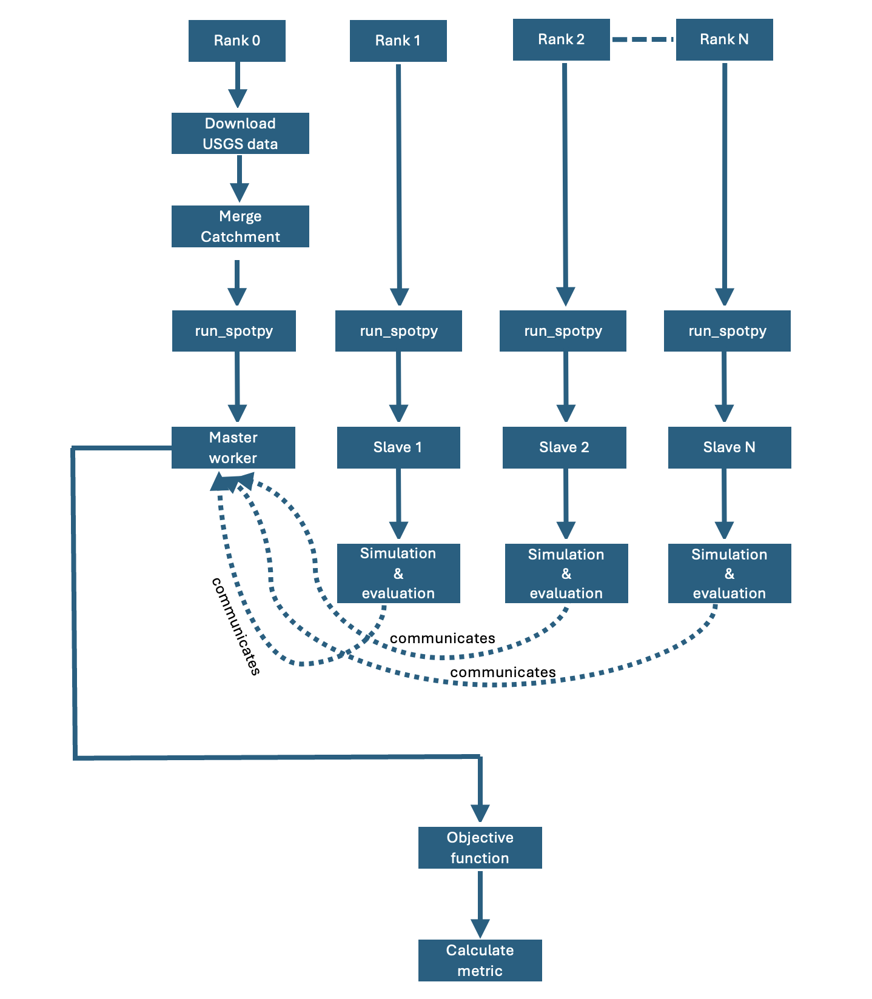
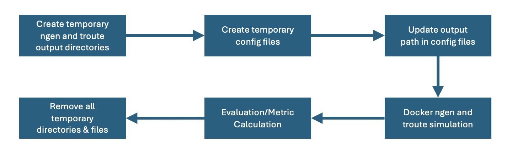

# NextGen Hydrologic Model Calibration

This tool performs automated calibration of the NextGen hydrologic model using SPOTPY optimization algorithms with MPI parallelization support.

## Table of Contents
- [Prerequisites](#prerequisites)
- [Installation](#installation)
- [Quick Start](#quick-start)
- [Command Line Arguments](#command-line-arguments)
- [Execution Modes](#execution-modes)
- [Usage Examples](#usage-examples)
- [Understanding the Output](#understanding-the-output)
- [Monitoring Progress](#monitoring-progress)
- [Troubleshooting](#troubleshooting)
- [Workflow](#workflow)

## Prerequisites

- Python 3.8+
- OpenMPI or MPICH
- Docker (for NextGen model execution)
- Superficial understanding of NGIAB_data_preprocessor workflow

## Installation

1. Clone the repository and navigate to the directory
2. Install OpenMPI:  
  a. For MacOS:
   ```bash
   brew install openmpi
   ```
  b. For Linux:
  ```bash
   sudo apt install openmpi-bin
   ```
3. Verify OpenMPI installation:
   ```bash 
   mpirun --version
   ```
4. Install required Python packages:
    ```bash
    pip install -r requirements.txt
    ```

## Quick Start

**Prepare Data:**
```bash
uvx --from ngiab_data_preprocess cli -i gage-10109001 -sfr --start 2015-10-01 --end 2019-12-01
```

**Serial execution (single process):**
```bash
python -u main.py \
    --gage_id 10109001 \
    --start_date 2015-10-01 \
    --end_date 2019-12-01 \
    --training_start_date 2017-10-02 \
    --data_root /path/to/your/data \
    --execution_mode serial
```

**Parallel execution (recommended for faster calibration):**
```bash
mpirun -n 11 --oversubscribe python -u main.py \
    --gage_id 10109001 \
    --start_date 2015-10-01 \
    --end_date 2019-12-01 \
    --training_start_date 2017-10-02 \
    --data_root /path/to/your/data (if you've trouble finding it, cat ~/.ngiab/) \
    --execution_mode parallel
```

**Note:**
-u flag is to force unbuffered I/O which helps to immediately write. Can be helpful for debugging because the print statement follows the sequential flow of the code. Can be removed later when output from docker run is suppressed.

## Command Line Arguments

### Required Arguments

| Argument | Type | Description | Example |
|----------|------|-------------|---------|
| `--gage_id` | string | USGS gage station ID | `10109001` |
| `--start_date` | string | Simulation start date (YYYY-MM-DD) | `2015-10-01` |
| `--end_date` | string | Simulation end date (YYYY-MM-DD) | `2019-12-01` |
| `--training_start_date` | string | Date to begin calibration (YYYY-MM-DD) | `2017-10-02` |
| `--data_root` | string | Root directory containing model data | `/home/user/data` |

### Optional Arguments

| Argument | Type | Default | Options | Description |
|----------|------|---------|---------|-------------|
| `--algorithm` | string | `SCE` | `SCE`, `DDS` | Optimization algorithm to use |
| `--objective_function` | string | `KGE` | `KGE`, `RMSE` | Objective function for calibration |
| `--repetitions` | integer | `10` | Any positive integer | Number of calibration iterations |
| `--dds_trials` | integer | `1` | Any positive integer | Number of trials for DDS algorithm (only used when `--algorithm DDS`) |
| `--execution_mode` | string | `parallel` | `serial`, `parallel` | Whether to run in serial or parallel mode |

### Help

View all available options:
```bash
python main.py --help
```

## Execution Modes

### Serial Mode
- Runs calibration using a single process
- Runs ngen simulation in parallel
- Use when testing or debugging
- Command: `python main.py [arguments] --execution_mode serial`

### Parallel Mode (Recommended)
- Runs calibration using multiple MPI processes
- Runs ngen simulation in serial
- Faster for complex calibrations (Scales way better than calibration in serial and ngen in parallel)
- Requires `mpirun` command
- **Important:** When using MPI, rank 0 acts as the master coordinator and doesn't run simulations
  - If you want N parallel simulations, use `mpirun -n N+1`
  - Example: For 10 parallel simulations, use `mpirun -n 11`

## Usage Examples

### Example 1: Basic parallel calibration with SCE algorithm
```bash
mpirun -n 11 --oversubscribe python main.py \
    --gage_id 10109001 \
    --start_date 2015-10-01 \
    --end_date 2019-12-01 \
    --training_start_date 2017-10-02 \
    --data_root /home/slama/Documents/hf3_remap/hf3_remap/output \
    --algorithm SCE \
    --objective_function KGE \
    --repetitions 500 \
    --execution_mode parallel
```

### Example 2: Calibration with DDS algorithm
```bash
mpirun -n 6 --oversubscribe python main.py \
    --gage_id 10109001 \
    --start_date 2015-10-01 \
    --end_date 2019-12-01 \
    --training_start_date 2017-10-02 \
    --data_root /home/slama/Documents/hf3_remap/hf3_remap/output \
    --algorithm DDS \
    --objective_function RMSE \
    --dds_trials 2 \
    --repetitions 500 \
    --execution_mode parallel
```

### Example 3: Serial execution for testing
```bash
python main.py \
    --gage_id 10109001 \
    --feature_id 2861391 \
    --start_date 2015-10-01 \
    --end_date 2019-12-01 \
    --training_start_date 2017-10-02 \
    --data_root /home/slama/Documents/hf3_remap/hf3_remap/output \
    --algorithm SCE \
    --repetitions 10 \
    --execution_mode serial
```

## Understanding the Output

### Directory Structure
After calibration completes, you'll find these outputs in your data directory:

```
data_root/gage-{gage_id}/
├── spotpy/
│   ├── best_params.csv              # Best calibrated parameters
│   ├── spotpy_results_SCE_KGE.csv   # Full optimization history
│   └── plots/                        # Diagnostic plots (if generated)
├── tensorboard_logs/                 # TensorBoard logging data
│   └── SCE_KGE_{gage_id}_{date}/
├── config/                 #realization file with updated best parameters
│   └── realization.json
```

### Best Parameters File
The `best_params.csv` file contains the optimized parameter values:
```csv
b,satpsi,satdk,maxsmc,expon,slope,K_nash_subsurface,K_lf,MFSNO,MP,RSURF_EXP,SNOW_EMIS,CWP,VCMX25,RSURF_SNOW,SCAMAX
6.715,0.143,0.000207,0.914,3.399,0.976,0.602,0.288,3.241,14.538,5.467,0.950,0.144,68.526,58.975,0.950
```

### SPOTPY Results
The `spotpy_results_*.csv` file contains the complete optimization history with:
- All parameter sets tested
- Objective function values
- Iteration numbers
- Chain/run information

### MPI Error Code
At the end of the calibration, either one of these statements is printed (depending on serial or parallel calibration used):  
If Parallel:
```bash
MPI_ABORT was invoked on rank 0 in communicator MPI_COMM_WORLD 
Proc: [[1066,1],0] 
Errorcode: 0 
```  
If Serial:
```bash  
Sorry! You were supposed to get help about: 
mpi-abort
```  
This is just a consequence of using MPI.abort to end the staggering processes. Nothing to worry about!

## Monitoring Progress

### Real-time Monitoring with TensorBoard
Monitor calibration progress in real-time:

```bash
# In a separate terminal, run:
tensorboard --logdir=/path/to/data_root/gage-{gage_id}/tensorboard_logs

# Open browser to: http://localhost:6006
```

TensorBoard displays:
- Objective function evolution
- Parameter traces
- Hydrograph comparisons
- Model performance metrics (NSE, KGE, RMSE, MAE)
- Residual analysis


## Troubleshooting

### Issue: "Not enough slots available"
**Error:** `There are not enough slots available in the system`

**Solution:** Add the `--oversubscribe` flag to mpirun:
```bash
mpirun -n 20 --oversubscribe python -u main.py [arguments]
```


### Issue: Process hangs or doesn't complete
**Symptoms:** Calibration starts but never finishes

**Solutions:**
1. Check if Docker is running: `docker run hello-world`. If there are any errors (specifically related to docker permission error), follow this post-installation docker steps provided in this link: https://docs.docker.com/engine/install/linux-postinstall/
2. Run with tagged output for debugging:
   ```bash
   mpirun -n 5 --tag-output python main.py [arguments] 2>&1 | tee debug.log
   ```

### Issue: "Rank 0 doesn't enter simulation"
**This is normal behavior!** 
- Rank 0 is the master coordinator in MPI parallel mode
- Only worker processes (ranks 1, 2, 3, ...) run simulations
- If you want 10 parallel simulations, use `mpirun -n 11` (1 master + 10 workers)

### Issue: Missing observed flow data
**Error:** Cannot find observed flow pickle file

**Solution:** The code automatically downloads USGS data on first run. Ensure:
1. You have internet connection
2. The gage_id is valid
3. Data exists for your specified date range

Check USGS data availability: https://waterdata.usgs.gov/nwis

### Issue: Docker command fails
**Error:** Docker execution fails during model run

**Solutions:**
1. Verify Docker image exists:
   `docker images | grep joshcu/ngiab`
   `docker images | grep awiciroh/ciroh-ngen-image`
3. Check Docker is running: `sudo systemctl status docker`
4. Ensure data directory is accessible: Check permissions on `data_root`
5. Test Docker manually:
   ```bash
   docker run --rm -it -v "/path/to/data:/ngen/ngen/data" joshcu/ngiab:fast_cal ls /ngen/ngen/data
   ```

## Workflow
**Parallel Calibration**  



**Simulation and Evaluation**


## Additional Notes


### Algorithm Selection
- **SCE-UA**: Shuffled Complex Evolution
  - More thorough global search
  - Better for complex parameter spaces
  
- **DDS**: Dynamically Dimensioned Search
  - Faster convergence
  - Good for refining parameters
  - Adjust `--dds_trials` to control exploration vs exploitation

### Recommended Workflow
1. Test with serial mode and 10 repetitions to verify setup
2. Run parallel calibration with 100-200 repetitions
3. Examine TensorBoard plots to assess convergence
4. If needed, run additional iterations starting from best parameters
5. Validate results on independent time period

## Support
1. Examine TensorBoard logs for detailed diagnostics
2. Check SPOTPY documentation: https://spotpy.readthedocs.io/
